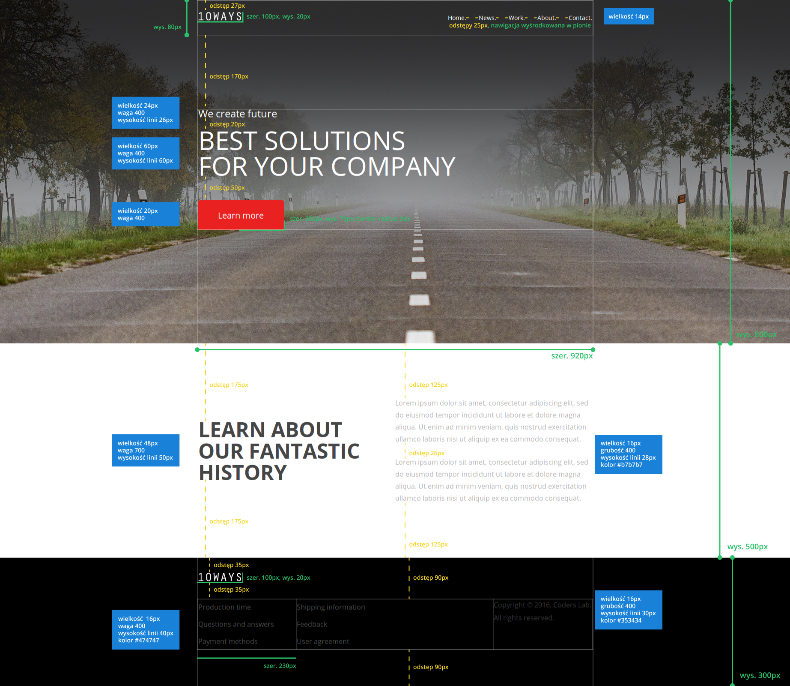

# Zaawansowany HTML i CSS &ndash; egzamin

## Stwórz stronę na podstawie poniższych wytycznych:

**Wytyczne dotyczące repozytorium**

1. Stwórz [**fork**][forking]  repozytorium z tym egzaminem.
2. [**Sklonuj**][ref-clone] repozytorium na swój komputer.
3. Gdy skończysz [**skomituj**][ref-commit] zmiany do swojego repozytorium.
4. [**Wypchnij**][ref-push] zmiany do swojego repozytorium na GitHubie.
5. [Stwórz **pull request**][pull-request] do oryginalnego repozytorium, gdy skończysz zadanie.

Zmiany wprowadzaj w następujących plikach:
* **index.html**,
* **style.css**.

## Przed przystąpieniem do rozwiazywania zadań zwróć uwagę na strukturę pliku HTML. Aby dobrze rozwiazać zadania, przeczytaj dokładnie wytyczne oraz zastosuj dane, jakie zostały zawarte w pliku poglądowym z wymiarami.

**Wytyczne dotyczące projektu**

1. Przygotuj plik CSS do pracy. Zacznij od podstawowego resetu CSS. Dodaj również czcionkę. Font użyty w projekcie to **Open Sans**. Stwórz również klasy, które przydadzą Ci się do odpowiedniego pozycjonowania elementów na strone. Przyjmijmy, że szerokość strony to `920px`.

2. Do sekcji o id `welcome` wstaw odpowiedni obraz  (który znajduje się w katalogu `images`) jako tło.

3. Wstaw `header` do sekcji o id `welcome` oraz ustaw jego wysokość. Do elementu `header` Wstaw logo oraz nawigację i ustaw je odpowiednich miejscach.

4. Obok elementu `header` wstaw `div`, w którym będą nagłówki i przycisk. Odległość między elementem `header` i pierwszym nagłówkiem powinna być taka sama jak między końcem przycisku a końcem sekcji.

5. Drugiej sekcji z id `about` ustaw odpowiednią wysokość. Podziel sekcję na dwie, równe części. Tekst w obu kolumnach powinien być wyśrodkowany.

6. W elemencie `footer` wstaw logo oraz nawigację. Logo powinno mieć taką samą wielkość jak w elemencie `header`.

## Potrzebujesz pomocy?
* [FontSquirel &ndash; Open Sans](http://www.fontsquirrel.com/fonts/open-sans)

<!-- Links -->
[forking]: https://guides.github.com/activities/forking/
[ref-clone]: http://gitref.org/creating/#clone
[ref-commit]: http://gitref.org/basic/#commit
[ref-push]: http://gitref.org/remotes/#push
[pull-request]: https://help.github.com/articles/creating-a-pull-request
